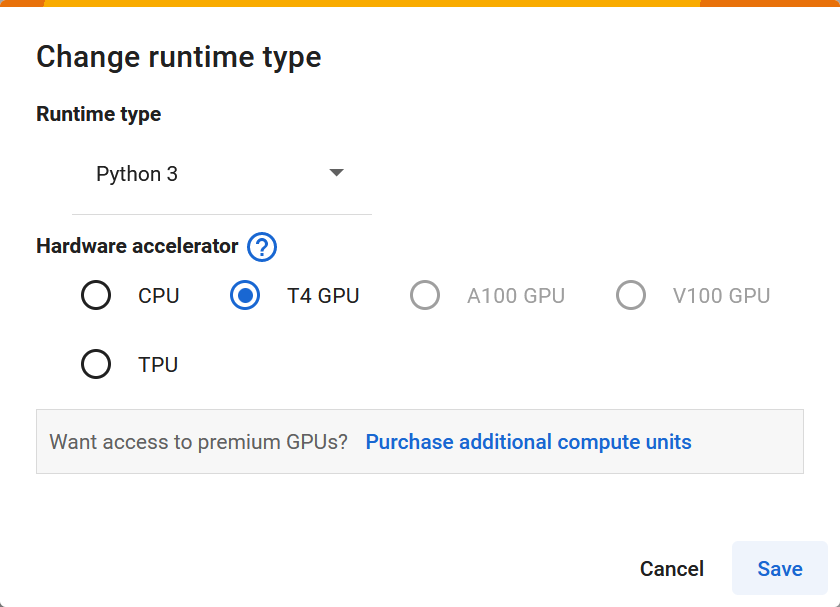

# Retrieval-Augmented Generation (RAG)

**Experience RAG in just a few minutes with free LLM model inference on NVIDIA GPU!**  
*Follow the 1~5 steps below, then run this [**Colab**](https://colab.research.google.com/github/Squirtle007/Retrieval-Augmented_Generation/blob/main/Retrieval_Augmented_Generation.ipynb)*.
 
 

 
 
 
**Step 1. Go to the [NVIDIA NGC](https://catalog.ngc.nvidia.com/) page, and Click on `Welcome Guest` at the top right, then choose [`Sign In/Sign Up`](https://ngc.nvidia.com/signin) to log in or register:**
 
 

 
 
 
**Step 2. In the search bar, type one of the available models (ex. [`Llama 2 70B`](https://build.nvidia.com/meta/llama2-70b) or [`Llama 2 13B`](https://catalog.ngc.nvidia.com/orgs/nvidia/teams/ai-foundation/models/llama2-13b/api)), then navigate to `Learn More`:**
 
 

 
 
 
**Step 3. Generate the API Key of the model and keep it; we will use this API later to perform inference through the NVIDIA Cloud-based LLM:**
 
 

 
 
 
**Step 4. Open [colab](https://colab.research.google.com/github/Squirtle007/Retrieval-Augmented_Generation/blob/main/Retrieval_Augmented_Generation.ipynb) and make sure you select `Runtime > Change runtime type > T4 GPU`.**
 
 

 
 

 
 
 
**Step 5. Paste your API Key into the cell at the beginning of the notebook, and then run the cell to access the Model on NGC:**
 
 

 
 
